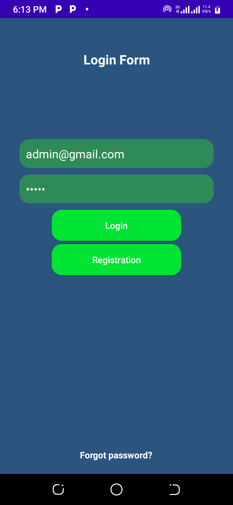
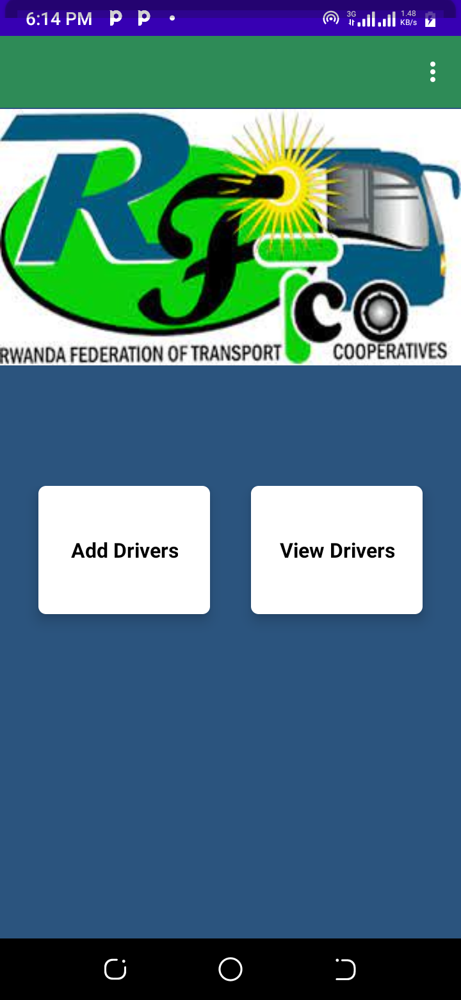
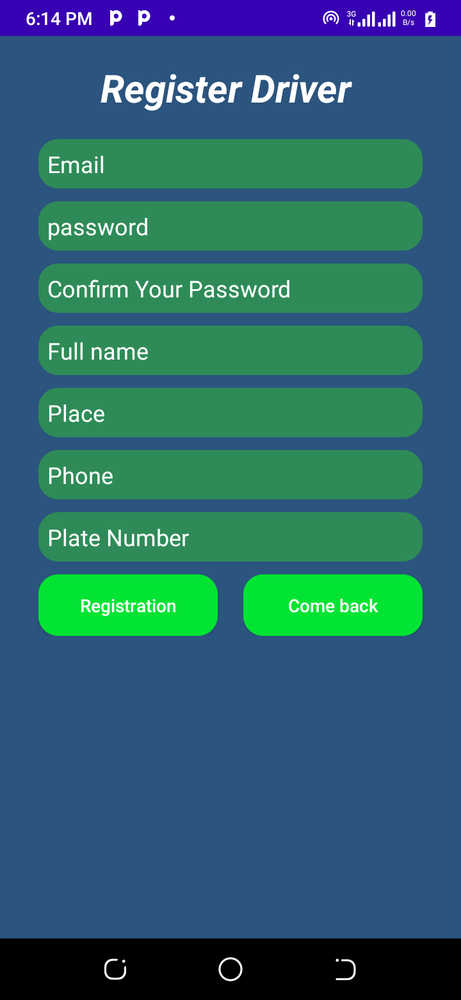
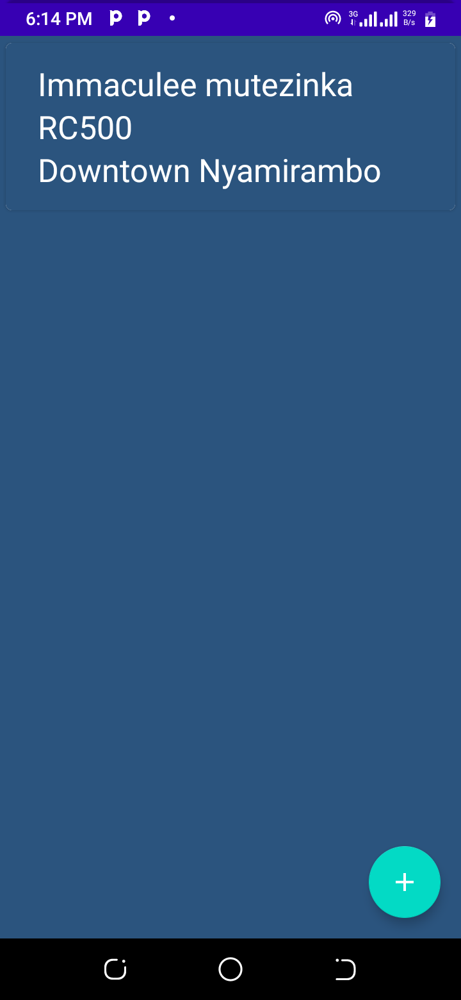
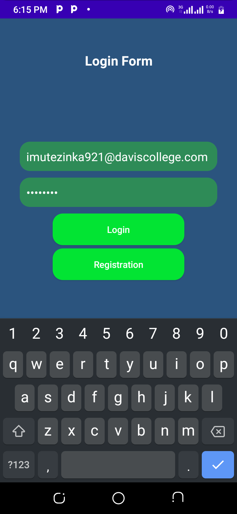
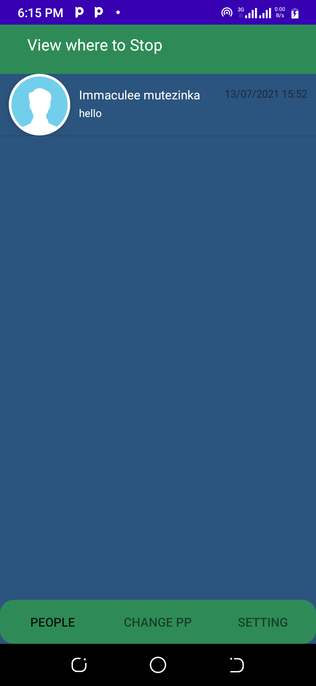
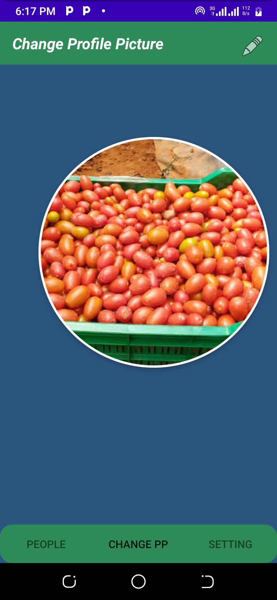
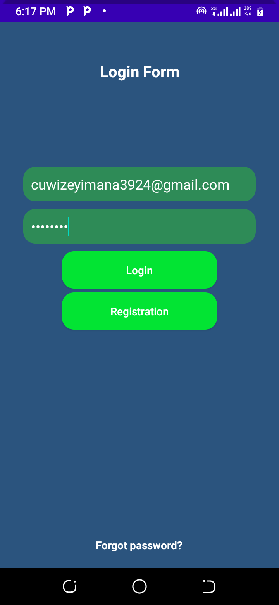
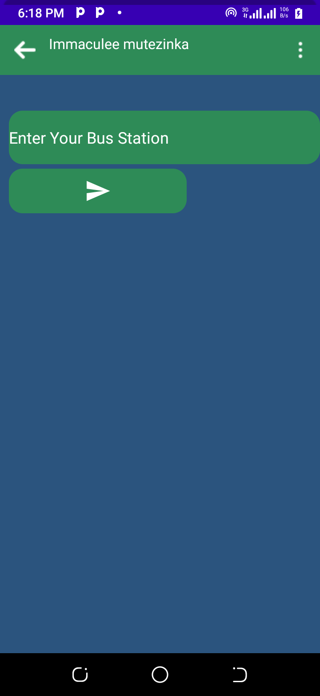
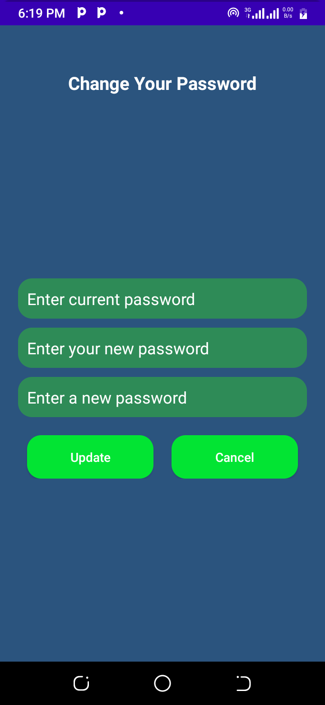

## RFTCLeaveapp
This projects help users to stop RFTC car without knocking on the door.  It contain three users, Admin, Drivers, and passengers and each user has their own page. Admin is the one who manages all users
# # Admin Pages

## Driver pages

## Passengers pages

